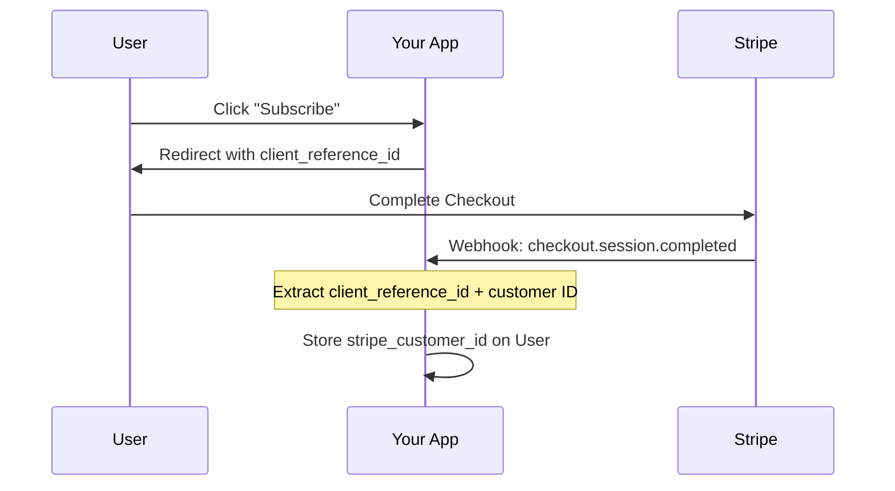

# Example: What a Great findings.md Looks Like

This is an annotated example showing confidence flags, inline conflict citations, Mermaid diagrams, and adaptive structure. Comments in `<!-- -->` explain the patterns.

---

# Research Findings: Stripe Minimal Backend Integration

**Date:** 2025-12-16

[← Back to Index](./index.md)

## Executive Summary

Stripe provides a comprehensive suite of hosted solutions that handle nearly the entire payment lifecycle without custom backend code. The minimal backend consists of storing a `stripe_customer_id` on your user record and one webhook endpoint. Subscription status can be queried on-demand from Stripe's API rather than maintaining local state.

<!-- Executive summary is 2-3 sentences — the essence of findings, not a comprehensive summary. -->

## Stripe's No-Code Checkout Options

<!-- Findings are organized by topic, not numbered rigidly. The heading describes the topic area, not "Finding 1." -->

Payment Links and the embeddable Pricing Table handle checkout without any backend code. Products, prices, and checkout UI are all configured in the Stripe Dashboard.

**Pricing Table** is the best fit for subscription-based products:
- Embeddable web component (`<stripe-pricing-table>`) showing subscription tiers
- Checkout happens on Stripe's hosted page — no card data touches your server
- Products and prices managed entirely in Dashboard
- Pass `client_reference_id` to link purchases to your users

**Payment Links** work best for one-off products or simple checkout:
- Shareable URLs that direct to Stripe-hosted checkout
- No backend required to generate — create once in Dashboard
- Append `client_reference_id={your_user_id}` to the URL

<!-- Code examples inline with analysis — not in a separate file. They make the finding concrete and actionable. -->

```
https://buy.stripe.com/abc123?client_reference_id=user_456&prefilled_email=user@example.com
```

## Linking Purchases to Your Users

The `client_reference_id` URL parameter (max 200 chars, alphanumeric/dashes/underscores) is the mechanism for connecting Stripe purchases to your internal user accounts.



<!-- This sequence diagram shows an interaction flow between multiple systems over time — exactly when a sequence diagram adds value. -->

> **Note:** `client_reference_id` only appears in successful checkout events, not in failed payment events. For failed payments, look up by email or use the customer ID if already stored. This is documented in Stripe's API reference but easy to miss.

<!-- This is a confidence flag on a specific detail — it's a "gotcha" that could trip someone up. Flagged because it's easy to miss, not because the source is unreliable. -->

## Webhook Requirements

For a minimal integration, you need only 1-2 webhook events:

| Event | When It Fires | What You Do |
|-------|---------------|-------------|
| `checkout.session.completed` | Purchase completes | Store Stripe customer ID on your user |
| `customer.subscription.deleted` | Subscription ends | Revoke premium access |
| `invoice.payment_failed` (optional) | Payment fails | Notify user |

You can start with just `checkout.session.completed` and add others as needed.

**Alternative — polling instead of webhooks:**

> **Conflicting guidance:** [Stripe's webhook documentation](https://docs.stripe.com/billing/subscriptions/webhooks) recommends webhooks as the primary mechanism for staying in sync. However, [Stripe's subscription API docs](https://docs.stripe.com/api/subscriptions/list) also support direct API queries (`GET /v1/subscriptions?customer={id}`), and several [community discussions on Stack Overflow (2025)](https://stackoverflow.com) describe polling-at-login as sufficient for low-traffic applications. For our use case (low volume, simplicity-first), polling at login is viable, but webhooks provide faster status updates and are the officially recommended path.

<!-- This demonstrates the conflicting sources pattern: both perspectives documented, sources cited inline with links, analysis of which applies to our context, user can evaluate themselves. -->

## Querying Stripe API for Status

Instead of caching subscription status locally, query Stripe directly:

```elixir
def check_subscription(user) do
  case Stripe.Subscription.list(%{customer: user.stripe_customer_id}) do
    {:ok, %{data: [%{status: "active"} | _]}} -> :active
    {:ok, %{data: [%{status: status} | _]}} -> String.to_atom(status)
    {:ok, %{data: []}} -> :none
    {:error, _} -> :error
  end
end
```

**Trade-offs:**
- (+) Always fresh data, no sync complexity
- (-) Network latency on every status check
- (-) Subject to Stripe rate limits (not an issue at low volume)

> **Note:** Stripe rate limits are generous for read operations, but if your application scales significantly, consider caching status with a short TTL (5 min) and using webhooks to invalidate the cache. This scaling concern is based on general API design principles — no specific Stripe rate limit documentation was found for subscription list queries.

<!-- This flags a finding where the specific detail (rate limit numbers) couldn't be confirmed. The general advice is sound, but the user should know the specificity gap. -->

## Cross-Cutting Themes

1. **Stripe handles the hard parts:** Payment processing, PCI compliance, card storage, SCA/3DS, failed payment retries — all delegated to Stripe's hosted infrastructure.
2. **Your backend is just the glue:** The only custom code maps user IDs to Stripe customer IDs. Everything else uses Stripe's hosted solutions or API.
3. **Simplicity vs flexibility trade-off:** No-code solutions are fastest but least customizable. The more control you need, the more backend code is required.

<!-- Cross-cutting themes synthesize across findings — patterns that span the whole research, not just individual topics. -->

## Gaps and Limitations

- **Pricing Table limited to 4 products per interval** — may not fit all pricing models
- **Customer Portal cannot be embedded in an iframe** — users leave your app to manage subscriptions
- **Usage-based billing not supported by Pricing Table** — requires Checkout Sessions API
- **No specific rate limit documentation found** for subscription list API queries — general API limits apply

<!-- Honest about what we don't know and what won't work. This saves the user from discovering limitations during implementation. -->

## Related Documents

- [Index](./index.md) — Research overview
- [Architecture Options](./architecture-options.md) — Integration pattern comparison
- [Resources](./resources.md) — All sources consulted
- [Recommendations](./recommendations.md) — Implementation plan
