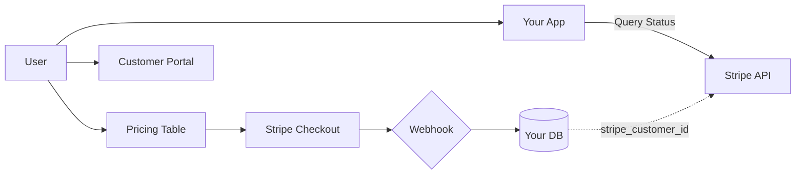

# Example: What a Great index.md Looks Like

This is an annotated example showing the quality standards for a research index file. Comments in `<!-- -->` explain why each section works.

---

# Research: Stripe Minimal Backend Integration

**Date:** 2025-12-16
**Research Question:** How to integrate Stripe with minimal backend code, leveraging hosted solutions for checkout and subscription management while connecting purchases to internal user accounts.

<!-- The research question is specific and scoped — not just "Stripe integration" but the specific angle being investigated. -->

## Overview

Stripe's hosted solutions (Payment Links, Pricing Table, Customer Portal) can handle the entire payment lifecycle with near-zero custom backend code. The only backend requirement is storing a mapping between internal user IDs and Stripe customer IDs, accomplished through a single webhook endpoint listening for `checkout.session.completed`. Subscription status can be queried directly from Stripe's API rather than maintaining local state.

<!-- The overview is 2-3 sentences capturing the single most important insight — not a summary of every finding. A reader who reads nothing else should understand the core answer. -->

## Key Takeaways

1. **Payment Links + Pricing Table = zero backend for checkout** — Products configured entirely in Stripe Dashboard, checkout UI hosted by Stripe, no card data touches your server
2. **Customer Portal eliminates subscription management UI** — Users self-serve upgrades, downgrades, cancellations, and payment method updates
3. **Only 1 webhook needed to start** — `checkout.session.completed` links Stripe customers to your users via `client_reference_id`
4. **Query Stripe API for status, don't cache locally** — Keeps data fresh, eliminates sync complexity, trades network latency for simplicity

<!-- Each takeaway explains WHY it matters, not just WHAT it is. "Payment Links + Pricing Table" alone is a fact; adding "= zero backend for checkout" makes it an insight. -->

## Concept Overview

<!-- This Mermaid diagram shows the architecture at a glance — a reader can understand the integration approach without reading the full findings. This is a good candidate for a concept map because there are multiple components interacting. -->

## Research Files

- **[Findings](./findings.md)** — Stripe's hosted solutions, user-to-Stripe linking, webhook requirements, API status queries
- **[Architecture Options](./architecture-options.md)** — Comparison of no-code vs low-code vs full API integration patterns
- **[Resources](./resources.md)** — Bibliography of Stripe documentation, community guides, and library references
- **[Recommendations](./recommendations.md)** — Phased implementation plan starting with Pricing Table embed

<!-- File descriptions tell the reader what's IN the file, not just what the file IS. "Core research findings" is useless. "Stripe's hosted solutions, user-to-Stripe linking..." tells you whether to click. -->

## Deep Dives

- **[Webhook Reliability Patterns](./deep-dives/webhook-reliability-2026-01-15/index.md)** — 2026-01-15 — Retry strategies, deduplication, and monitoring for production webhook endpoints

<!-- Deep dive links MUST point to index.md, not the directory. Directory links break in markdown viewers. -->
