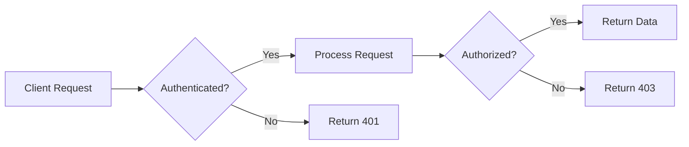
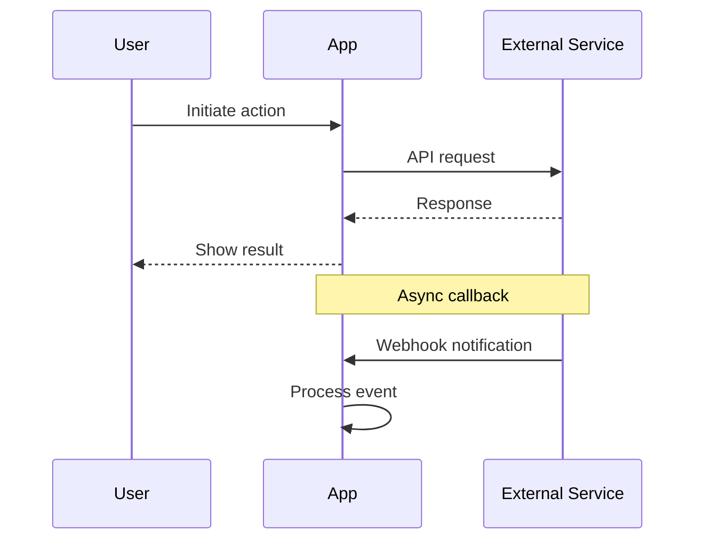
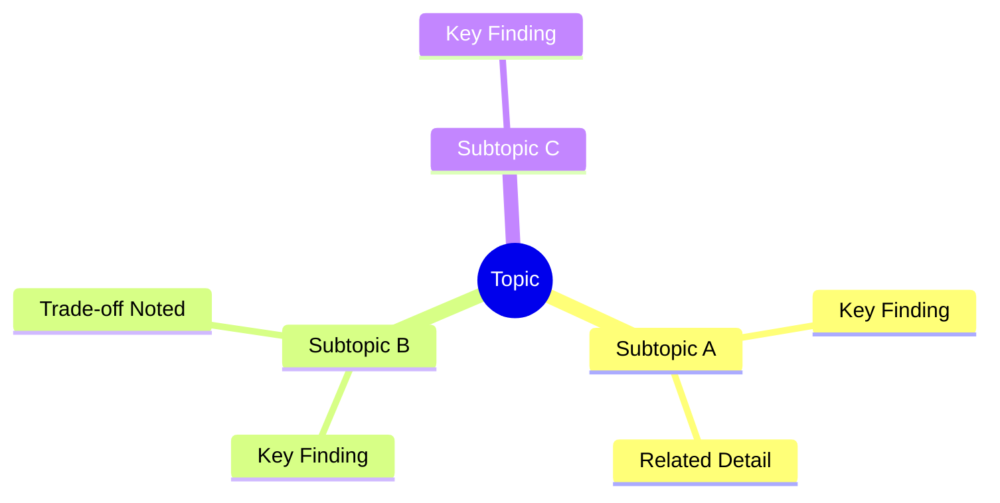
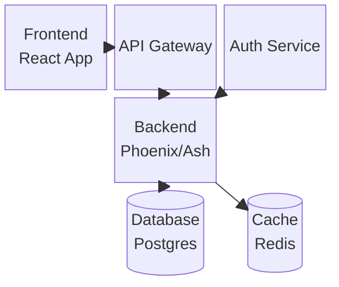
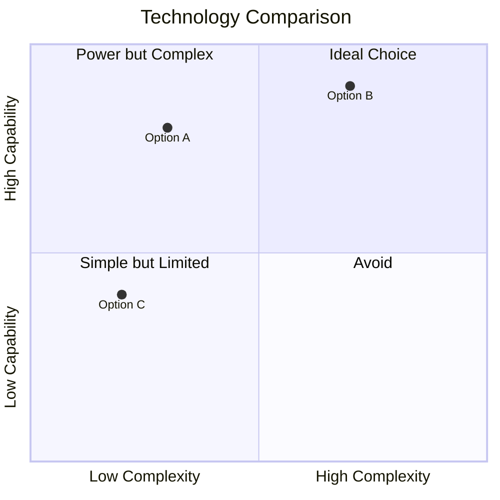
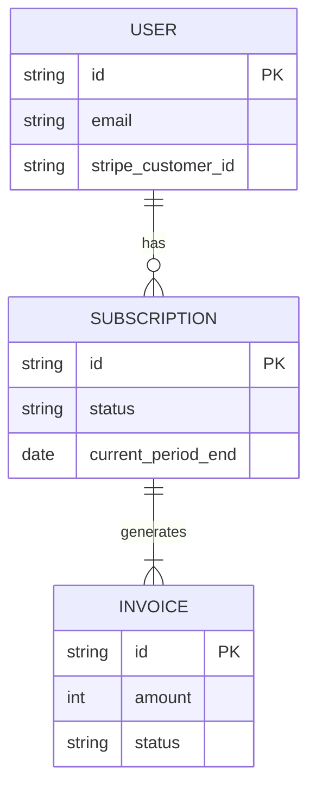
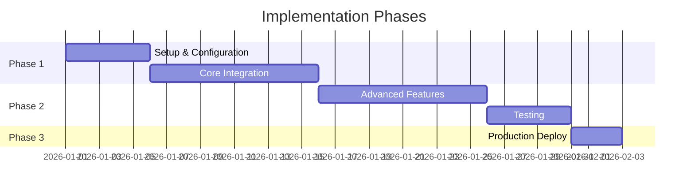

# Mermaid Diagram Patterns for Research

This document provides diagram patterns to use in research output. Reference this when you determine a diagram would help clarify a concept.

## When to Use Diagrams

**Strong candidates for diagrams:**
- Workflows and processes that have multiple steps or decision points
- Architecture and system design — how components connect and interact
- Dense technical concepts that are hard to explain in prose alone
- Comparisons between multiple options on two or more dimensions
- Sequences of interactions between systems or actors
- Data models and entity relationships

**Not worth diagramming:**
- Simple lists or single-dimension comparisons (use a table instead)
- Concepts that are already clear from a short paragraph
- Trivial flows with only 2-3 linear steps

Use your judgment. A diagram should save the reader time understanding a concept, not add decoration.

## Diagram Types and When to Use Each

### Flowchart — Decision Processes and Data Flow

Best for: Auth flows, request lifecycles, decision trees, build pipelines, any process with branching logic.

Use `LR` (left-to-right) for horizontal flows, `TD` (top-down) for vertical. Horizontal works better for linear pipelines; vertical works better for decision trees.

### Sequence Diagram — System Interactions

Best for: API call sequences, auth handshakes, webhook flows, any interaction between 2+ systems over time.

Use solid arrows (`->>`) for requests, dashed arrows (`-->>`) for responses. Add `Note over` for context.

### Mindmap — Concept Relationships and Topic Overview

Best for: Research topic decomposition, showing how findings relate, concept maps in index.md.

Good for the visual concept overview in index.md — shows the reader the shape of the research at a glance.

### Block Diagram — Architecture Overview

Best for: System architecture, deployment topology, component relationships, infrastructure layouts.

### Quadrant Chart — Two-Axis Comparison

Best for: Comparing options on two dimensions (complexity vs capability, cost vs performance, effort vs impact).

Useful in technology evaluations and landscape surveys to visually position options.

### Entity Relationship Diagram — Data Models

Best for: Database schemas, API entity relationships, data model documentation.

### Gantt Chart — Implementation Timelines

Best for: Phased implementation plans, project timelines in recommendations.

Use in recommendations.md when suggesting a phased approach.

## Formatting Tips

- Keep diagrams focused — if it's getting complex, split into multiple smaller diagrams
- Add labels and descriptions on arrows/connections when the relationship isn't obvious
- Use consistent naming across diagrams in the same research (same component names)
- Test that the Mermaid syntax is valid — broken diagrams are worse than no diagrams
- Prefer horizontal (`LR`) flowcharts for processes and vertical (`TD`) for hierarchies
